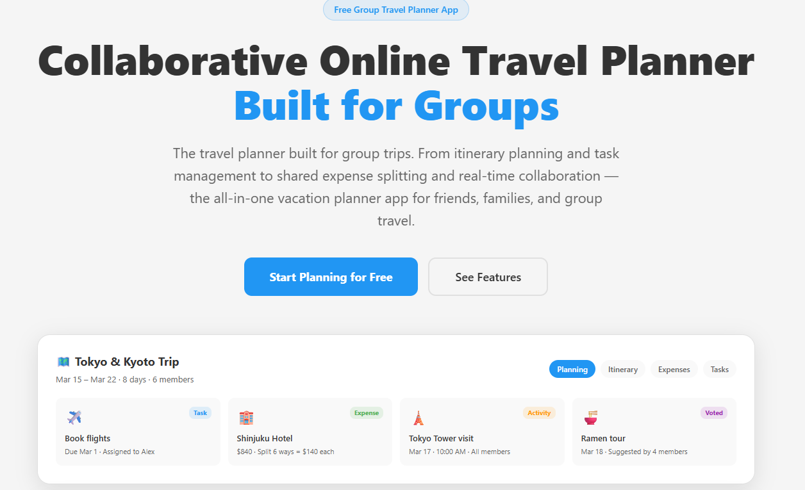

# Travel Gang

A collaborative trip planning application built with React, Firebase, and Vite. Create shared plans for group trips, manage tasks, split expenses, and collaborate in real time.



## 🚀 Features

- **User Authentication** — Sign up, login, and logout with Firebase Auth
- **Plan Management** — Create plans with dates, tasks, activities, and expenses
- **Real-time Collaboration** — Invite members via link or QR code
- **Expense Tracking** — Split costs evenly or custom between members
- **Pricing Plans** — Individual, Business, and Lifetime Deal options
- **Affiliate Program** — Earn commissions by referring customers

## 🛠️ Tech Stack

- **Frontend:** React 19, React Router, Vite
- **Backend:** Firebase (Auth, Firestore, Cloud Functions)
- **Payments:** Stripe

## 📦 Installation

1. Clone the repository:
```bash
git clone https://github.com/YOUR_ORG/travel-gang.git
cd travel-gang
```

2. Install dependencies:
```bash
npm install
```

3. Create a `.env` file (see `.env.example` for required variables)

4. Run the development server:
```bash
npm run dev
```

## 🔐 Environment Variables

Copy `.env.example` to `.env` and fill in your Firebase and Stripe credentials. Never commit `.env` to version control.

## 📄 License

MIT License.
